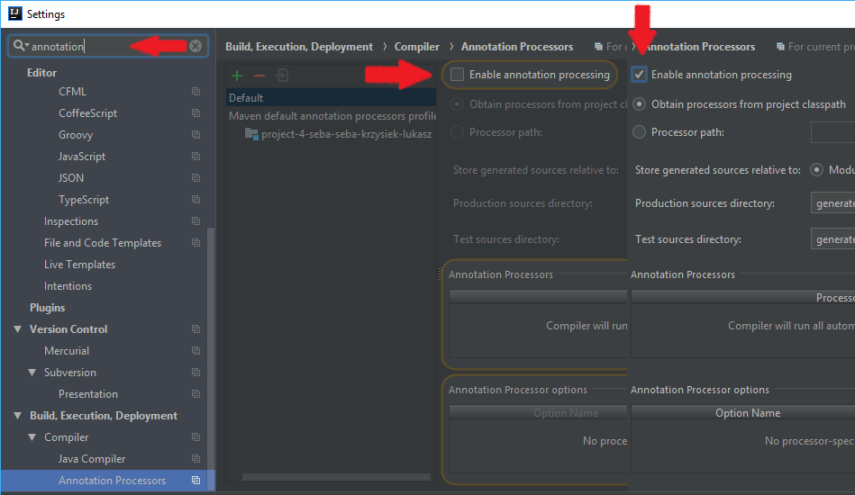
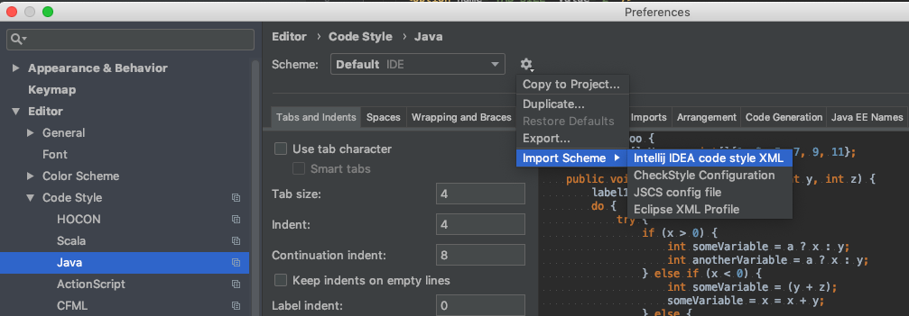
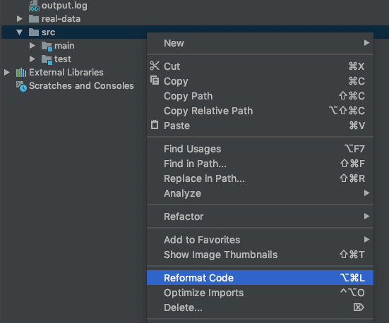
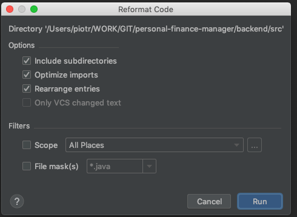
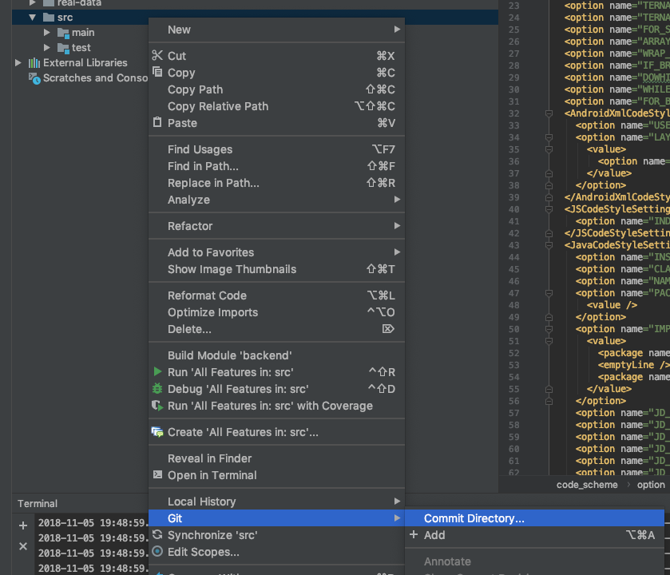
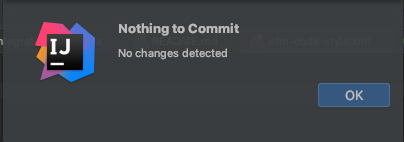

# Personal Finance Manager

System allowing users to manage their personal finances.

Define accounts, categories and you are ready to track your transactions.

## Demo instance
[Personal Finance Manager demo instance](http://personal-finance-manager.s3-website.us-east-2.amazonaws.com/accounts)

## API Reference
[Swagger API](http://ec2-3-120-209-115.eu-central-1.compute.amazonaws.com:8088/swagger-ui.html)

## Technologies & Frameworks

### Frontend
- [Angular](https://angular.io/)
- [Bootstrap](https://getbootstrap.com/)
- [npm](https://www.npmjs.com/)

### Backend
- [H2](http://www.h2database.com)
- [Spring data](https://projects.spring.io/spring-data/)
- [Gradle](https://gradle.org/)
- [JUnit](https://maven.apache.org/)
- [Mockito](http://site.mockito.org/)
- [Swagger](https://swagger.io/)
- [Hibernate](http://hibernate.org/)
- [Lombok](https://projectlombok.org/)
- [Spring Boot](https://spring.io/projects/spring-boot)

### Tests
- [Gradle](https://gradle.org/)
- [REST Assured](http://rest-assured.io/)
- [Selenium](https://www.seleniumhq.org/)
- [TestNG](https://testng.org)

### Automation
- [Jenkins](https://jenkins.io/)
- [AWS](https://aws.amazon.com/)
- [Bash](https://www.gnu.org/software/bash/)

### Code Quality
- [Checkstyle](http://checkstyle.sourceforge.net/)
- [FindBugs](http://findbugs.sourceforge.net/)
- [PMD](https://pmd.github.io/)
- [Jacoco](https://www.eclemma.org/jacoco/)

## How to start project locally

1. Install [JDK 11](https://jdk.java.net/11/), [NodeJS](https://nodejs.org/en/), [Angular CLI](https://cli.angular.io/)
2. Open terminal window, go to **_backend_** directory & run **_./gradlew bootRun_**
3. Open second terminal window, go to **_frontend_** directory, run **_npm install_** & **_ng serve --open_**
4. Browser window will open automatically, you can play with the application

## Running application in IntelliJ
- Open IntelliJ, click open project, select **_build.gradle_** file, click **_import as project_**
- Enable annotation processing for Lombok. \

- Wait for Gradle to download half of the internet :)
- Right click on **_Application.java_** and select **_Run_**

## Setting up code formatter in IntelliJ
- Select IntelliJ > Preferences > Editor > Code Style > Java
- Select Import scheme -> IntelliJ IDEA XML \

- Select backend/config/pfm-code-style.xml file and click OK
- Right click on src directory and select Reformat \

- On the dialog select first 3 checkboxes \

- Right click on src directory and select Git > Commit \

- You should see "No changes" dialog \

## Checklist before merging to branch master
- Check if application passes gradle build task
- Check if application starts with PostgreSQL database
- Check if swagger is working
- Run application and test it manually:
  - Register user
  - Login with registered user
  - Add account, category, transaction and filter
  - Delete everything added

## Building and pushing docker image (remember to increase the number)
- docker build . -t piokol/pfm:9
- docker run -it --user root piokol/pfm:9 /bin/bash (optional just to check image)
- docker push piokol/pfm:9
